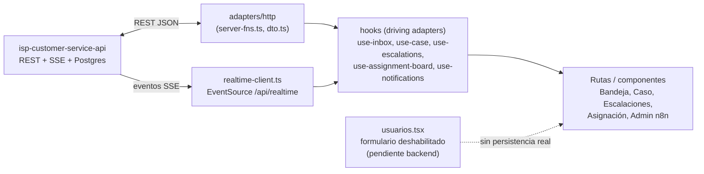

# 00_OVERVIEW.md

## Frontend operativo para isp-customer-service-api (tipo Whaticket/Chatwoot, adaptado al negocio ISP)

> Este paquete (`00` a `06`) es la fuente de verdad para reconstruir el frontend sobre el backend real `isp-customer-service-api`. Reemplaza el contrato mock anterior (`VITE_API_BASE_URL` + `/api/*` genérico) documentado implícitamente en el código previo de `src/adapters/http/`. El contrato normativo del backend vive en `isp-customer-service-api/docs/spec/00-03` y `docs/API_ENDPOINTS.md` — este paquete no lo repite completo, lo referencia.

## 1. Principio rector (heredado del backend, no negociable)

```
API   → "¿Qué está pasando y qué debe ocurrir?"   → fuente de verdad, decide, persiste
IA    → "¿Qué quiso decir el usuario?"             → interpreta, nunca gobierna el estado
n8n   → "¿Cómo ejecuto esta integración?"          → ejecuta, nunca decide
UI    → "¿Qué está pasando y quién lo atiende?"    → supervisa, interviene, reactiva
```

El frontend **nunca** decide negocio ni duplica estado: todo lo que se ve viene de una lectura al backend (REST o SSE), y toda acción del agente es una llamada a un endpoint real. Ningún dato de operación (conversaciones, mensajes, casos, escalaciones, agentes, departamentos, auditoría, dashboard) se simula ni se hardcodea en esta etapa.

## 2. Regla de identidad (sin JWT todavía)

El backend no tiene login/JWT: la identidad se declara con `agentUserId` (body) / header `x-agent-id` / `userId` (query), usando UUIDs reales de `GET /api/agents`. Consecuencias de diseño:

- La sesión del frontend se construye **directamente** sobre `AgentDto` real — el `id` de sesión **es** el `agent.id` de la base de datos, sin tabla puente ni ID local paralelo.
- No hay `POST /api/agents` hoy. La pantalla `/usuarios` conserva su formulario de crear/editar/activar-desactivar (para no perder el trabajo de UI ya hecho), pero queda **deshabilitado** con un aviso explícito de "pendiente de backend" — nunca simula una creación que no persiste de verdad. Ver `06_BACKEND_GAPS.md`.
- El login (`/login`) deja de validar una contraseña falsa (`password.length >= 6`, que no validaba nada real) y pasa a ser un selector de perfil sobre agentes reales activos.

## 3. Stack

- **Framework**: TanStack Start + TanStack Router + TanStack Query (ya en uso, se mantiene).
- **HTTP**: `fetch` contra `isp-customer-service-api`, envoltura `{ data }` / `{ error: { type, message } }` (`03_API_CONTRACT.md` §C del backend).
- **Tiempo real**: `EventSource` nativo sobre `GET /api/realtime?userId=` (SSE, no WebSocket) — reemplaza el polling anterior.
- **Estado de sesión**: `useSyncExternalStore` sobre `localStorage` solo para *cuál* `agent.id` está activo en este navegador (no para los datos del agente en sí, que siempre se refrescan desde `GET /api/agents`).
- **UI**: Radix + Tailwind (sin cambios, se mantiene el sistema de diseño existente en `src/components/ui`).

## 4. Componentes y flujo



## 5. Documentos de este paquete

| Doc | Contenido |
|---|---|
| `00_OVERVIEW.md` | Este documento |
| `01_DATA_MODEL.md` | DTOs de frontend, `CaseContext` tipado, tipos locales (sesión, notificaciones) |
| `02_MODULES.md` | Mapeo módulo → ruta → endpoints; qué pantalla se adapta/reemplaza/elimina |
| `03_REALTIME_NOTIFICATIONS.md` | Cliente SSE, catálogo de eventos → reacción UI, ventana de resumen de escalación |
| `04_ASSIGNMENT_MANAGEMENT.md` | UI de gestión/monitoreo de carga y reasignación manual sobre endpoints reales |
| `05_BUILD_PLAN.md` | Etapas de construcción, con criterios de aceptación |
| `06_BACKEND_GAPS.md` | Huecos detectados en el backend (CRUD de agentes, algoritmo de auto-asignación) — documentados, no implementados aquí |

## 6. No-negociables de este frontend

- Sin datos mock/quemados en pantallas de operación (bandeja, casos, escalaciones, asignación, auditoría, dashboard).
- Ninguna acción de escritura se simula: si el endpoint no existe, la UI lo muestra explícitamente como pendiente (nunca oculta la limitación).
- El cliente nunca inventa estados de `Case` fuera del catálogo real (`NEW/ACTIVE/WAITING_USER/PAUSED/ESCALATED/HUMAN_ACTIVE/COMPLETED/EXPIRED/CANCELLED`).
- Visibilidad por defecto: cualquier agente lee (bandeja compartida); solo el `assignedAgentId` o un `manager/admin` de su departamento escribe.
- Todo error de la API se muestra al agente de forma clara (nunca un `[object Object]` ni un stack trace).
