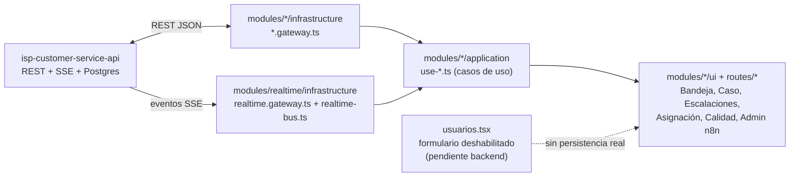

# 00_OVERVIEW.md

## Frontend operativo para isp-customer-service-api (tipo Whaticket/Chatwoot, adaptado al negocio ISP)

> Este paquete (`00` a `07`) es la fuente de verdad para reconstruir el frontend sobre el backend real `isp-customer-service-api`. Reemplaza el contrato mock anterior (`VITE_API_BASE_URL` + `/api/*` genérico) documentado implícitamente en el código previo de `src/adapters/http/`. El contrato normativo del backend vive en `isp-customer-service-api/docs/spec/00-03` y `docs/API_ENDPOINTS.md` — este paquete no lo repite completo, lo referencia.

## 1. Principio rector (heredado del backend, no negociable)

```
API   → "¿Qué está pasando y qué debe ocurrir?"   → fuente de verdad, decide, persiste
IA    → "¿Qué quiso decir / cómo fue la atención?" → interpreta o evalúa calidad, nunca gobierna el estado
n8n   → "¿Cómo ejecuto esta integración?"          → ejecuta, nunca decide
UI    → "¿Qué está pasando, quién lo atiende y cómo atiende?" → supervisa operación y calidad humana, interviene, reactiva
```

El frontend **nunca** decide negocio ni duplica estado: todo lo que se ve viene de una lectura al backend (REST o SSE), y toda acción del agente es una llamada a un endpoint real. Ningún dato de operación (conversaciones, mensajes, casos, escalaciones, agentes, departamentos, auditoría, dashboard, **calidad**) se simula ni se hardcodea en esta etapa.

## 2. Regla de identidad (login real con sesión de servidor)

Desde `docs/spec/06_BACKEND_GAPS.md` §1.b, el backend tiene login real: `POST /api/auth/login` valida correo + contraseña (argon2) y deja una cookie `httpOnly` de sesión (token opaco en Redis, expiración deslizante de 12h). El header `x-agent-id` y los `agentUserId`/`actorId` que antes se declaraban en body/query **ya no se usan como identidad** — el backend siempre resuelve "quién soy" a partir de la cookie real, nunca de algo que el cliente afirme. Consecuencias de diseño:

- La sesión del frontend se construye **directamente** sobre `AgentDto` real, consultado con `GET /api/auth/me` (nunca cacheado como fuente de verdad) — el `id` de sesión **es** el `agent.id` de la base de datos.
- El frontend nunca lee ni escribe la cookie de sesión directamente (es `httpOnly`, invisible a JavaScript). Todo `fetch` manda `credentials: "include"` (`shared/http/http-client.ts`) para que el navegador la adjunte sola.
- `POST /api/agents` genera una **contraseña temporal** automáticamente (el proyecto no tiene infraestructura de correo para invitar al agente) — se muestra una única vez en `/usuarios` justo después de crear o de "Restablecer contraseña".
- Cada agente puede cambiar su propia contraseña desde el menú de perfil (`POST /api/auth/change-password`), requiriendo la contraseña actual.

## 3. Stack

- **Framework**: TanStack Start + TanStack Router + TanStack Query (ya en uso, se mantiene).
- **HTTP**: `fetch` contra `isp-customer-service-api`, envoltura `{ data }` / `{ error: { type, message } }` (`03_API_CONTRACT.md` §C del backend).
- **Tiempo real**: `EventSource` nativo sobre `GET /api/realtime?userId=` (SSE, no WebSocket) — reemplaza el polling anterior. `withCredentials: true` para que la cookie de sesión viaje también en la conexión SSE.
- **Estado de sesión**: `TanStack Query` sobre `GET /api/auth/me` (`identity/application/use-session.ts`) — nunca `localStorage`; la fuente de verdad de "quién soy" es siempre la cookie httpOnly que solo el backend puede leer/escribir.
- **UI**: Radix + Tailwind (sin cambios, se mantiene el sistema de diseño existente en `src/components/ui`).

## 4. Componentes y flujo



Ver `docs/FOLDER_STRUCTURE.md` y `docs/skills/frontend-hexagonal-architecture.md` para el detalle de por qué el código se organiza en `src/modules/<feature>/{domain,application,infrastructure,ui}` en vez de las carpetas planas (`lib/`, `hooks/`, `components/`) con las que arrancó este paquete de specs.

## 5. Documentos de este paquete

| Doc | Contenido |
|---|---|
| `00_OVERVIEW.md` | Este documento |
| `01_DATA_MODEL.md` | DTOs de frontend, `CaseContext` tipado, tipos locales (sesión, notificaciones), DTOs de calidad |
| `02_MODULES.md` | Mapeo módulo → ruta → endpoints; qué pantalla se adapta/reemplaza/elimina |
| `03_REALTIME_NOTIFICATIONS.md` | Cliente SSE, catálogo de eventos → reacción UI, ventana de resumen de escalación |
| `04_ASSIGNMENT_MANAGEMENT.md` | UI de gestión/monitoreo de carga y reasignación manual sobre endpoints reales |
| `05_BUILD_PLAN.md` | Etapas de construcción, con criterios de aceptación |
| `06_BACKEND_GAPS.md` | Huecos detectados en el backend (CRUD de agentes, algoritmo de auto-asignación, chat interno persistente) — documentados, no implementados aquí |
| `07_QUALITY_SUPERVISION.md` | Panel `/calidad`: ranking, reviews, highlight de mensajes, coaching híbrido + deep-link chat |

Fuera de `docs/spec/` (normativo del backend a consumir), este paquete agrega:

| Doc | Contenido |
|---|---|
| `docs/FOLDER_STRUCTURE.md` | Árbol completo de `src/` por módulo hexagonal |
| `docs/skills/frontend-hexagonal-architecture.md` | Por qué y cómo se dividen domain/application/infrastructure/ui |
| `docs/skills/solid-principles-frontend.md` | SOLID con ejemplos reales de este repo |
| `docs/skills/design-patterns-frontend.md` | Patrones usados (Gateway, Custom Hook as Use Case, Observer, Facade...) |
| `docs/skills/ui-ux-design-principles.md` | Decisiones de UI/UX específicas de este producto (no genéricas) |
| `docs/skills/testing-strategy-frontend.md` | Runner configurado (Vitest + Testing Library), qué y cómo probar por capa, criterio de aprobación por etapa |

## 6. No-negociables de este frontend

- Sin datos mock/quemados en pantallas de operación (bandeja, casos, escalaciones, asignación, auditoría, dashboard, calidad).
- Ninguna acción de escritura se simula: si el endpoint no existe, la UI lo muestra explícitamente como pendiente (nunca oculta la limitación).
- El cliente nunca inventa estados de `Case` fuera del catálogo real (`NEW/ACTIVE/WAITING_USER/PAUSED/ESCALATED/HUMAN_ACTIVE/COMPLETED/EXPIRED/CANCELLED`).
- Visibilidad por defecto: cualquier agente lee (bandeja compartida); solo el `assignedAgentId` o un `manager/admin` de su departamento escribe.
- Panel `/calidad` solo `manager`/`admin`; scores y findings solo desde `/api/quality/*` (nunca inventados en cliente).
- Todo error de la API se muestra al agente de forma clara (nunca un `[object Object]` ni un stack trace).
